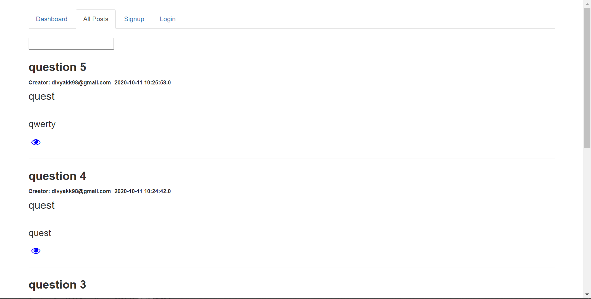
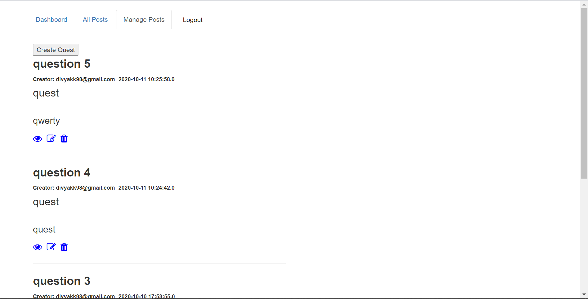
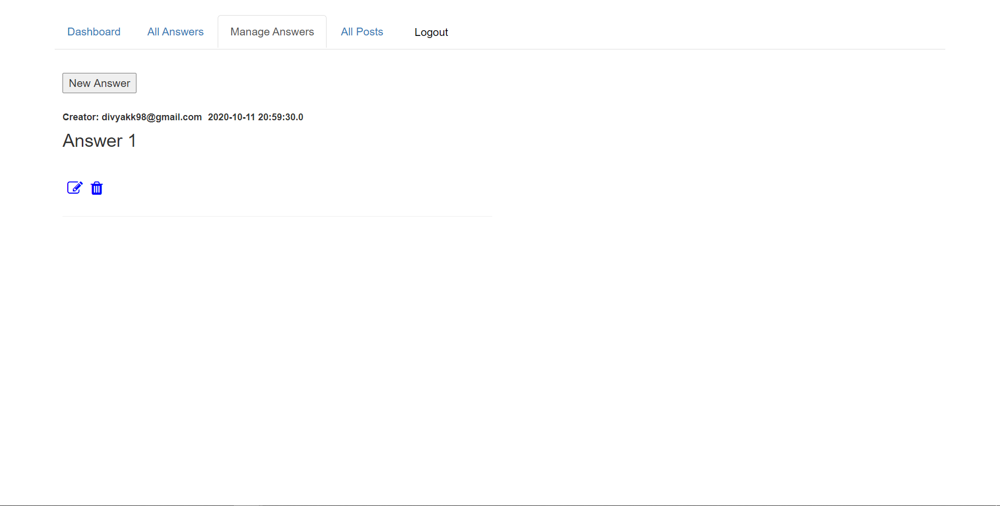
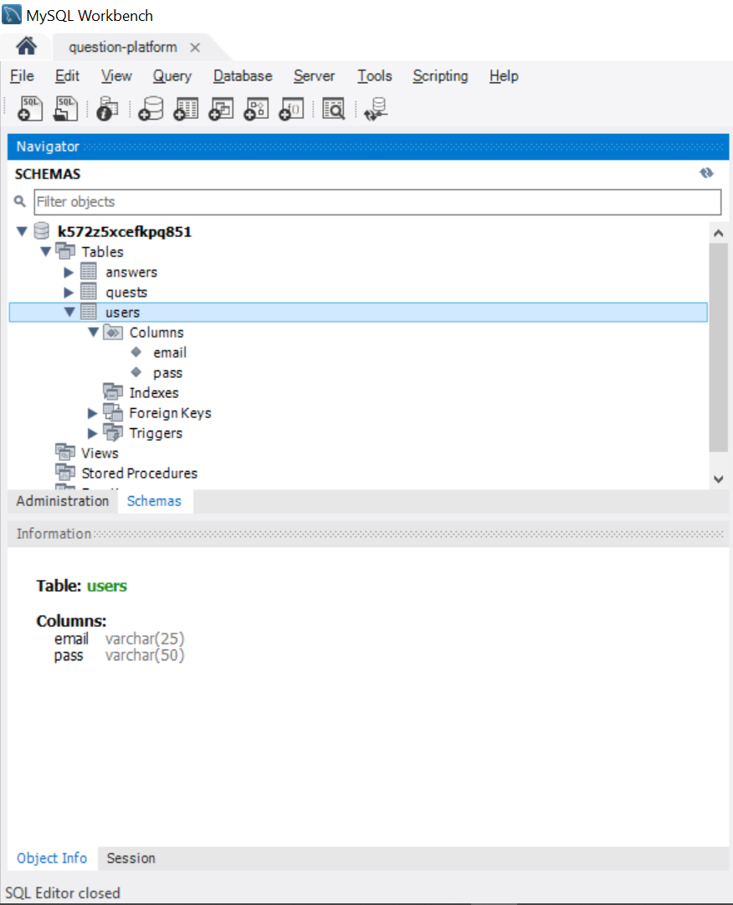
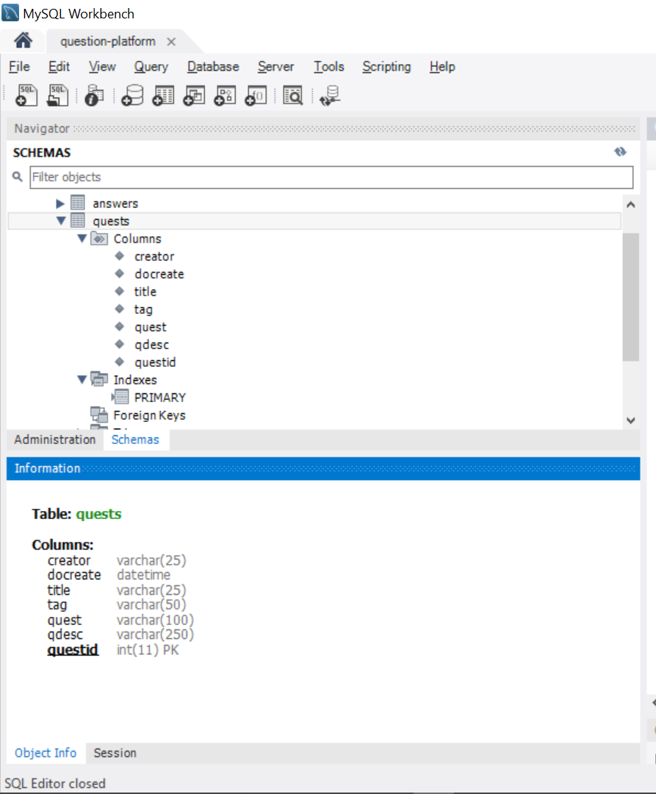
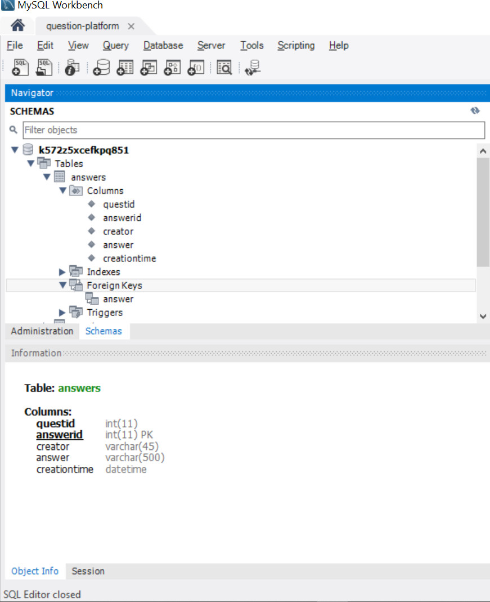

# Question Platform

Question related fields: Title, tag, questions, Description
 
Answer related fields: Answer

# Role 1

Unregistered User

View Questions and Answers
Search questions by title/tag

# Role 2

Registered User

1. Create Questions
2. Answer to questions

 If creator of Question / Answer can update or delete them respectively.
 
 
 
 
 # Database Structure
 
 User
 Columns: email id, password
 
 
 
 Questions
 Columns: quest id, creation time, title, tag, quest, description, creator
 
 
 
 Answer 
 Columns: quest id, answer id, creator, answer, creation time
 
 
 

 
